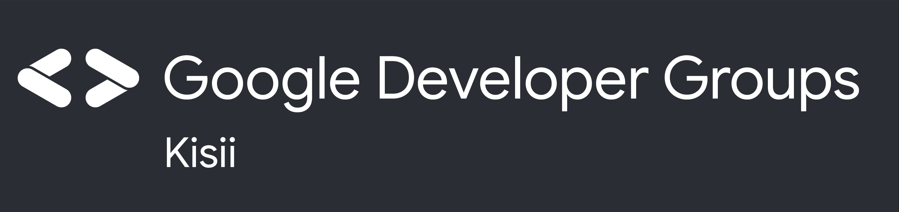

# Angular Workshop: From 0 to Mastering the foundational building blocks with Project Book (Hands-on)
GDG Kisii workshop series for Frontend developers focusing on Angular Framework., May 18th 2023 - June 18th 2023.
### Key pointers on sessions
| Activity  | Description   |
|---|---|
| Duration  | 4 Weeks   |
| Session | 2 hrs per week | 
| Mode of delivery | Online |
| Platform of delivery |[https://www.stack-stream.com/gdg-kisii](https://www.stack-stream.com/gdg-kisii) |
| Facilitator |Kelvin Otundo ([@Kelvin Otundo](https://twitter.com/kelvinotundoKE))|
|   |

---
## Description
In this workshop we will build a Book Management Application with Angular using `components`, `services`,` dependency injection`, `forms`, `Angular modules` and `lazy loaded routes`. 

> A high-performing database is crucial to any organization. Databases support the internal operations of companies and store interactions. This project will leverage Firebase and be guided on how to store and manage data.

By the end of this workshop you will have built a working Angular applications you can extend into an enterprise application. You will also walk away with the source code and the course material. 
## Content process

## Set up instructions
You can code along if you like. If you plan to do so, 
- please bring your own laptop with [Google Chrome](https://www.google.com/chrome/) 
- ([Canary](https://www.google.com/chrome/canary/)), 
- [Git](https://git-scm.com/), 
- Latest version of [Node.js](https://nodejs.org/), and 
- Text editor of your choice [WebStorm](https://www.jetbrains.com/webstorm/) or [Visual Studio Code](https://code.visualstudio.com/) installed.
- Create and setup [Firebase account](https://firebase.google.com/). 

You need unlimited Internet access (without group policies, corporate proxies or firewalls). In case of doubt, please bring your personal notebook with you.

## Audience and requirements
This workshop is for beginner friendly, and or you already building Angular Projects. All requirements can be found in this GitHub repository: 
No Prior knowledge in Angular, however you MUST have strong foundation in JavaScript ft Typescript(optional).

- Internet connectivity

- BYOL(Bring your own Laptop).

- Commitment to learn for the 1 Month period. The program will follow incremental approach of building project.

## More sessions on the track

## FAQ

## About Speaker
Kelvin would be described as a polyglot computer programmer with over 6-years experience in the tech industry. He has aquired knowledge and skills in: C, C++, Java, Kotlin, Go, Python and specialist as a JavaScript Fullstack developer.  His quest for software developement has led him to acquire modern certifications in computing and programming including: Mobile Web Specialist and Associate Android Developer from Andela, Google Program. And recently NodeJS Application Development from [OpenJS](https://openjsf.org/).
He currently work as a Technical Trainer at Kisii National Polytechnic and a freelancer in crafting Mobile, Desktop and Web Applications.
### Learn more about Kelvin at:

  

|Social  | Link   |
|---|---|
| YouTube  |[Kelvin Otundo](https://www.youtube.com/@kelvinotundo2071)   |
| Twitter  |[@Kelvin Otundo](https://twitter.com/kelvinotundoKE)   |
| LinkedIn  |[Kelvin Otundo](https://ke.linkedin.com/in/kelvin-otundo-b7489877)   |
## About GDG Kisii

The [Google Developer Group (GDG) Kisii](https://gdg.community.dev/gdg-kisii/) Chapter is for tech enthusiasts, makers, software artisans and creators who are interested in learning, sharing and getting to know more of Google developer tools & technologies.
>`Disclaimer`: GDG Kisii is an independent group; our activities and the opinions expressed here should in no way be linked to Google, the corporation. To learn more about the GDG program, visit [GDG](https://developers.google.com/community/gdg/).

> Stay up to date – sign up for our newsletter and get the latest updates about the sessions
> Sign up [here](https://gdg.community.dev/gdg-kisii/)

